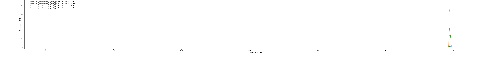
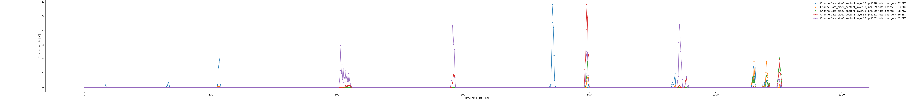
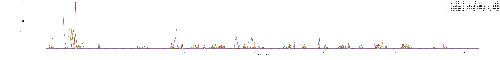
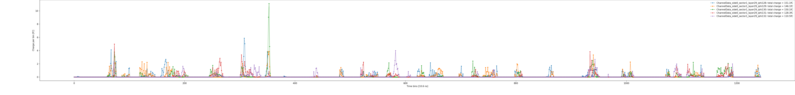

# Introduction

This data set are example TPC FEE input charge simulated with following setup: 

* Core software update: https://github.com/blackcathj/coresoftware/pull/new/tpc_charge
* Macro for single track: https://github.com/blackcathj/macros/pull/new/tpc_charge_single
* Macro for central AuAu + 200kHz pileup: https://github.com/blackcathj/macros/pull/new/tpc_charge_0-4fm_200kHz_AuAu

Three scenarios are simulated:
* `SingleTrack`: a single 20 GeV pi- track in near central psuedorapidity and max-drift
* `0-4fm_AuAu`: a single central Au+Au collision
* `0-4fm_100kHz_AuAu`: a single central Au+Au collision embedded into 100kHz MB AuAu collision pile ups. This is the typical high multiplicity environment sPHENIX TPC are expected to operate in. Please note the occupancy varys significantly from channel to channel. And the multiplcity would be enven higher in 200kHz Au+Au collsions below. 
* `0-4fm_200kHz_AuAu`: a single central Au+Au collision embedded into 200kHz MB AuAu collision pile ups. This is the typical highest multiplicity environment sPHENIX TPC are expected to operate in. 

The result are in self-explaintory `JSON` files recording 1-drift window of charge data for each channels separted in ~10ns time bins. Files are separated with TPC side/sector/layers. 

# Example reading code

Here is an example inspection code as following:

See [ReadME.ipynb](https://nbviewer.jupyter.org/github/sPHENIX-Collaboration/tpc-fee-input-charge/blob/master/ReadME.ipynb)

# Example charge input plots (click figures to enlarge)

Single track: 

Single 0-4fm central AuAu collision track: 

Typical higher occupancy scenario with 100kHz collisions: 

Typical higher occupancy scenario with 200kHz collisions: 

